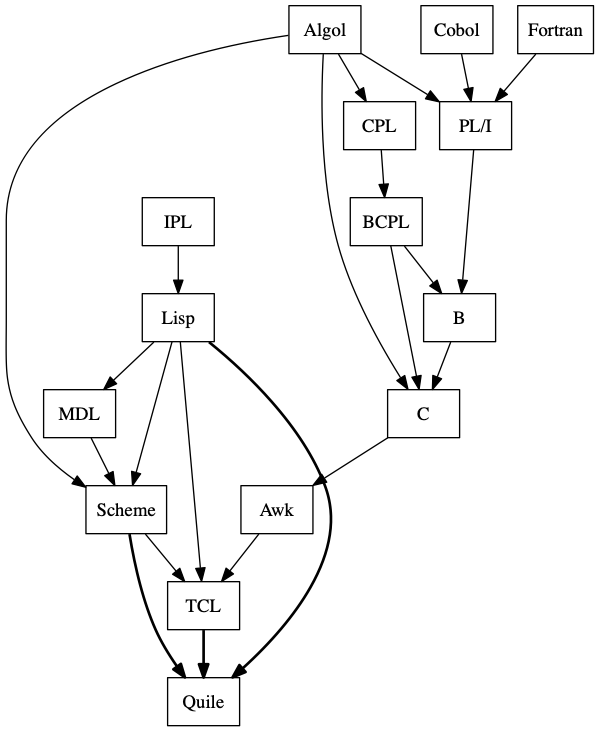

# {Quile}

The *Quile* scripting language is a hybrid dialect of Lisp, Scheme and TCL: 

It has been designed to be small, easy to expand and easy to embed in host applications. 
The core of the language is made of a single [C++ header](src/quile.h) (~ 1000 loc in total) and a  [small library](src/core.tcl) written using *Quile* itself.

*Quile* includes several neat features among which:

* homoiconicity and introspection
* macros
* tail recursion
* static and dynamic scoping
* partial evaluation
* lambda functions with closures

For an overview on the language, please see [this example](examples/overview.tcl); for an example on how to integrate the language in your application, please check the [main file](src/quile.cpp).

(c) 2020 by Carmine E. Cella, www.quile.org
